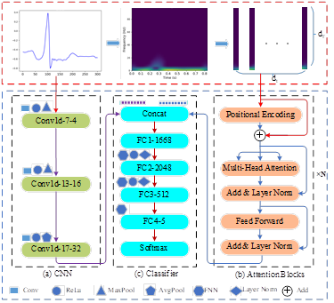
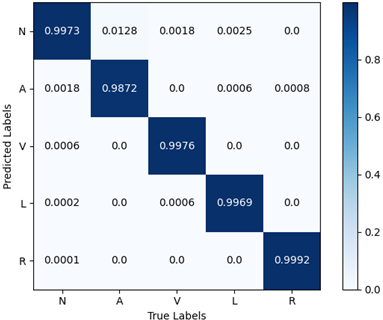

# ECG-CNN-Former: A CNN+Attention Neural Network for ECG  arrhythmias classification

ECG arrhythmias are an important tool for the diagnosis of cardiovascular diseases, and their automatic classification is of great clinical importance. In order to improve the accuracy of ECG arrhythmias classification, a deep learning model of CNN+Attention is proposed by combining one-dimensional convolutional neural network and attention mechanism, using CNN to extract one-dimensional time-domain features of ECG signals. To address the problem of limited ability to characterize the time-domain features of one-dimensional temporal ECG signals, the short-time Fourier transform is used to transform the ECG signals into the time-frequency domain, and the global correlation dependencies of the ECG signals in the time-frequency domain are extracted by Attention, and the time-domain and time-frequency domain features are fused to classify five types of ECG signals. The effectiveness of the model was verified on the MIT-BIH dataset. The average classification accuracy, precision, recall, sensitivity and F1_Score of the proposed model for the five types of ECG signals were 99.72%, 98.55%, 99.46%, 99.90% and 99.00%, respectively. The comparison with existing advanced methods validates the advanced performance of the proposed model.
## dataset
MIT-BIH Arrhythmia Database
Download link: [https://physionet.org/content/mitdb/1.0.0/](https://physionet.org/content/mitdb/1.0.0/)
## network 

## results

| arrhythmia class | Precision | Recall | Specificity |F1_Score |Accuracy
|------|------|------|------|------|------|
| N |99.91%|	99.74%|	99.69%|	99.82%|	99.73%|
| A |93.85%	|98.07%	|99.86%	|95.91%	|98.72%|
| V |99.39%	|99.82%	|99.95%|	99.60%	|99.76%|
| L | 99.69%|	99.69%|	99.98%|	99.69%|	99.69%|
| R | 99.92%|	100%|	100%|	99.96%|	99.92%|
| total | 98.55%|	99.46%|	99.90%|	99.00%|	99.72%|
